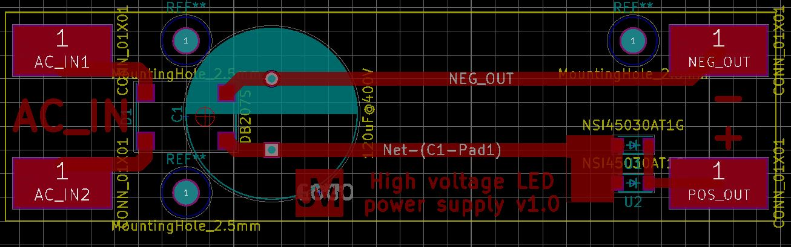
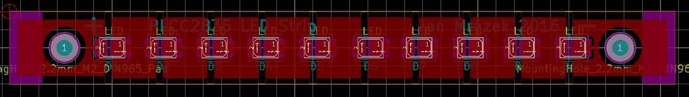
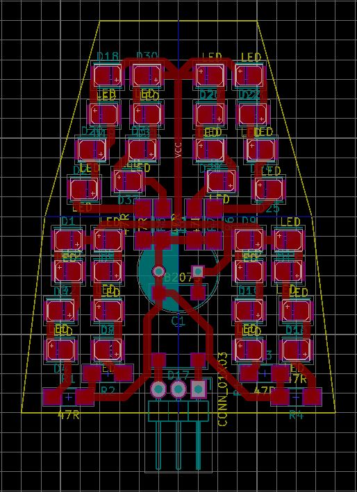

# LED lightning

The 2835 LEDs claim to be very efficient. I got sick of the Chinese 12 V LED
strips which connect 3 LEDs in series with a resistor. There is a roughly 30 %
power loss in the resistor. So I tried to design an LED strip without a current 
limiting resistor. 100 LEDs are connected in a series and powered from a 60 mA
constant current power supply. Everything is designed for European AC mains.

CAUTION! There is high voltage on the power supply and LED strip. The device
is connected to AC mains! Please, be careful.

There is also a replacement for a 12 V halogen light bulb in a desktop lamp.

# Power supply

# LED strip

# Halogen replacement

